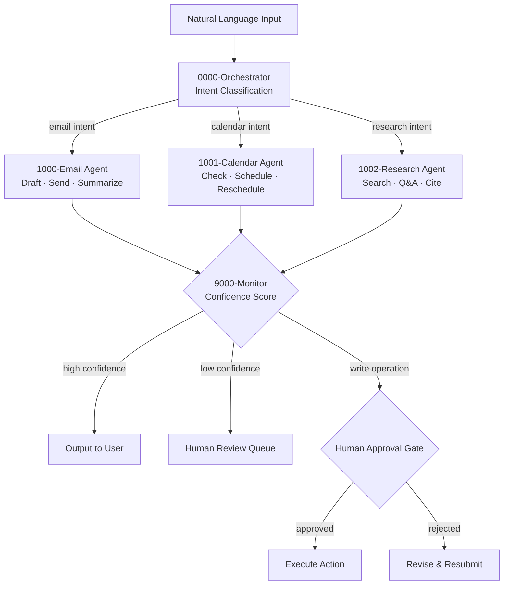

# n8n-ai-agent-delegator

> Multi-agent AI task delegation architecture for n8n — a central orchestrator routes natural-language commands to specialized agent workflows with confidence scoring and human-in-the-loop gates.

**Tested on:** n8n v1.x.x | **License:** MIT | **Status:** Active

---

## What It Does

A production-grade multi-agent system built entirely in n8n:

- **Central orchestrator** — classifies natural-language commands and routes to the right specialist agent
- **Email agent** — draft, send, and summarize emails
- **Calendar agent** — check availability, schedule/reschedule meetings
- **Research agent** — web search, document Q&A via vector database
- **Confidence scoring** — every agent output includes a confidence score; low scores route to human review
- **Human-in-the-loop** — write operations (send, create, publish) always require human approval

Uses error handling patterns from [n8n-error-handling-pattern](https://github.com/lorenzespinosa/n8n-error-handling-pattern).
Integrates with legal ops workflows from [n8n-legal-ops-templates](https://github.com/lorenzespinosa/n8n-legal-ops-templates).

## Architecture



> **Important:** The human approval gates in agent workflows are structural placeholders. In production, replace the Code nodes with n8n [Wait](https://docs.n8n.io/integrations/builtin/core-nodes/n8n-nodes-base.wait/) or [Form](https://docs.n8n.io/integrations/builtin/core-nodes/n8n-nodes-base.form/) nodes for actual blocking approval.

## Agent Naming Convention

| Tier | Prefix | Role | Example |
|------|--------|------|---------|
| Orchestrator | `0000` | Central controller, routing | `0000-orchestrator.json` |
| Agents | `1xxx` | Specialist task execution | `1000-agent-email.json` |
| Monitoring | `9xxx` | Scoring, logging, metrics | `9000-monitor.json` |

## How to Import

1. Download workflow JSONs from the `workflows/` directory
2. Import the orchestrator first, then agents, then monitor
3. Import error handling sub-workflows from [n8n-error-handling-pattern](https://github.com/lorenzespinosa/n8n-error-handling-pattern)
4. Configure credential placeholders (documented per workflow)
5. Set `active: true` only after testing with sample commands from `payloads/`

## Workflows

| File | Agent | Description |
|------|-------|-------------|
| `0000-orchestrator.json` | Orchestrator | Intent classification + routing to specialists |
| `1000-agent-email.json` | Email | Draft, send, summarize emails |
| `1001-agent-calendar.json` | Calendar | Check, schedule, reschedule events |
| `1002-agent-research.json` | Research | Web search, document Q&A, citations |
| `9000-monitor.json` | Monitor | Confidence scoring + audit logging |

## Multi-Platform

| Platform | Coverage |
|----------|---------|
| n8n | Full workflow JSON (importable) |
| Make | `docs/make-equivalent.md` — orchestrator pattern guide |
| Zapier | `docs/zapier-equivalent.md` — orchestrator pattern guide |

## Business Impact

*(Coming in v0.2.0 — task delegation time savings, accuracy metrics)*

## Contributing

See [CONTRIBUTING.md](./CONTRIBUTING.md). All contributions require confidence scoring and human-in-the-loop gates on write operations.

## License

[MIT](./LICENSE) © 2025 Lorenz Espinosa

---

## Quick Start

```bash
# Clone and explore
git clone https://github.com/lorenzespinosa/n8n-ai-agent-delegator.git
cd n8n-ai-agent-delegator

# Import workflows into n8n (order matters)
# 1. Import error handling patterns from n8n-error-handling-pattern
# 2. Import 9000-monitor.json first (other agents reference it)
# 3. Import agent workflows (1000-1002)
# 4. Import 0000-orchestrator.json last (routes to agents)
# 5. Configure OpenAI API credentials
# 6. Test with sample commands from payloads/
```

## Related Projects

- [n8n-error-handling-pattern](https://github.com/lorenzespinosa/n8n-error-handling-pattern) — Error handling sub-workflows imported by the orchestrator
- [n8n-legal-ops-templates](https://github.com/lorenzespinosa/n8n-legal-ops-templates) — Legal ops workflows that integrate with the agent system
