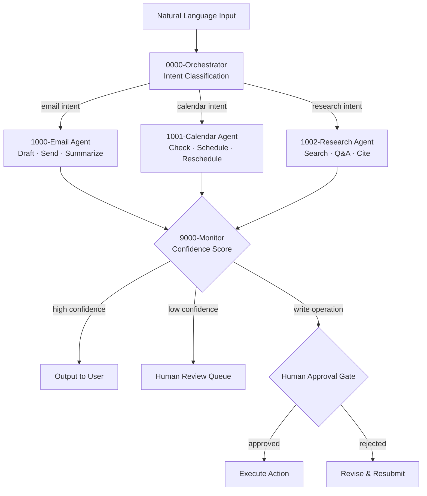

# n8n-ai-agent-delegator

> Multi-agent AI task delegation architecture for n8n — a central orchestrator routes natural-language commands to specialized agent workflows with confidence scoring and human-in-the-loop gates.

**Tested on:** n8n v1.x.x | **License:** MIT | **Status:** Active

---

## What It Does

A production-grade multi-agent system built entirely in n8n:

- **Central orchestrator** — classifies natural-language commands and routes to the right specialist agent
- **Email agent** — draft, summarize, and (gated) send emails
- **Calendar agent** — check availability, schedule/reschedule meetings
- **Research agent** — web search synthesis with citations
- **Confidence scoring** — every agent output includes a confidence score; low scores route to human review
- **Human-in-the-loop** — write operations (send, create, reschedule) pass through an approval gate before execution

The orchestrator also defines a fifth `content` route, but no content agent ships in this repo yet — that switch branch is a placeholder for a future `1003-agent-content` workflow.

Uses error handling patterns from [n8n-error-handling-pattern](https://github.com/lorenzespinosa/n8n-error-handling-pattern).
Integrates with legal ops workflows from [n8n-legal-ops-templates](https://github.com/lorenzespinosa/n8n-legal-ops-templates).

## Architecture


```mermaid
flowchart TD
    INPUT["Natural Language Input"] --> ORCH["0000-Orchestrator<br/>Intent Classification"]

    ORCH --> |"email intent"| EMAIL["1000-Email Agent<br/>Draft · Send · Summarize"]
    ORCH --> |"calendar intent"| CAL["1001-Calendar Agent<br/>Check · Schedule · Reschedule"]
    ORCH --> |"research intent"| RES["1002-Research Agent<br/>Search · Q&A · Cite"]
    EMAIL --> CONF{"9000-Monitor<br/>Confidence Score"}
    CAL --> CONF
    RES --> CONF

    CONF -->|"high confidence"| OUT["Output to User"]
    CONF -->|"low confidence"| HUMAN["Human Review Queue"]
    CONF -->|"write operation"| APPROVE{"Human Approval Gate"}

    APPROVE -->|"approved"| EXEC["Execute Action"]
    APPROVE -->|"rejected"| REVISE["Revise & Resubmit"]
```

> **Important:** The human approval gates in agent workflows are structural placeholders. In production, replace the Code nodes with n8n [Wait](https://docs.n8n.io/integrations/builtin/core-nodes/n8n-nodes-base.wait/) or [Form](https://docs.n8n.io/integrations/builtin/core-nodes/n8n-nodes-base.form/) nodes for actual blocking approval.

## Agent Naming Convention

| Tier | Prefix | Role | Example |
|------|--------|------|---------|
| Orchestrator | `0000` | Central controller, routing | `0000-orchestrator.json` |
| Agents | `1xxx` | Specialist task execution | `1000-agent-email.json` |
| Monitoring | `9xxx` | Scoring, logging, metrics | `9000-monitor.json` |

## How to Import

1. Download workflow JSONs from the `workflows/` directory
2. Import the agents (`1000`–`1002`) and `9000-monitor` first, then the orchestrator last — the orchestrator references each agent by workflow ID via Execute Workflow nodes
3. After import, paste each agent's workflow ID into the matching Execute Workflow node in `0000-orchestrator`
4. Import error handling sub-workflows from [n8n-error-handling-pattern](https://github.com/lorenzespinosa/n8n-error-handling-pattern)
5. Configure credential placeholders (documented per workflow) and replace placeholder URLs (`api.example.com`, Slack `PLACEHOLDER`, `SPREADSHEET_ID`)
6. Set `active: true` only after testing with sample commands from `payloads/`

## Workflows

Each agent is a standalone workflow with its own webhook entry point. The orchestrator calls them via Execute Workflow nodes (set the target workflow IDs after import).

| File | Webhook path | Trigger | What it routes / does | Node & credential TYPES needed |
|------|-------------|---------|-----------------------|--------------------------------|
| `0000-orchestrator.json` | `POST /orchestrator` | Webhook | Keyword pre-classify → OpenAI intent classify → Switch routes to email / calendar / research / content / unknown → aggregate → confidence gate | Webhook, Code, HTTP Request (OpenAI chat completions, header-auth API key), Switch, IF, Execute Workflow, Respond to Webhook |
| `1000-agent-email.json` | `POST /agent-email` | Webhook | Switch on action: `draft` (OpenAI), `send` (approval gate → HTTP placeholder), `summarize` (OpenAI) | Webhook, Code, Switch, HTTP Request (OpenAI + email send endpoint) |
| `1001-agent-calendar.json` | `POST /agent-calendar` | Webhook | Switch on action: `check` / `schedule` / `reschedule` against a calendar API | Webhook, Code, Switch, HTTP Request (calendar API, e.g. Google Calendar) |
| `1002-agent-research.json` | `POST /agent-research` | Webhook | Web search → OpenAI synthesizes findings with citations | Webhook, Code, HTTP Request (web search API + OpenAI) |
| `9000-monitor.json` | `POST /monitor` | Webhook | Composite confidence score → IF threshold → Slack alert (low) + Google Sheets audit log | Webhook, Code, IF, HTTP Request (Slack incoming webhook + Google Sheets API) |

All external HTTP Request nodes ship with `retryOnFail` enabled (3 tries, 2s backoff). OpenAI and other API calls use n8n's generic header-auth credential type — no keys are embedded in the JSON; placeholder URLs (`api.example.com`, `PLACEHOLDER`, `SPREADSHEET_ID`) must be replaced with your own.

## Usage Example

A natural-language command sent to the orchestrator webhook:

```bash
curl -X POST https://<your-n8n-host>/webhook/orchestrator \
  -H "Content-Type: application/json" \
  -d '{ "command": "Research recent Florida DUI case law on breath test refusal penalties in 2024" }'
```

How it flows through the system (matches `payloads/command-research.json`):

1. **Extract Intent** — the Code node lowercases the command and keyword-matches `research`, `case law`, `look up` → `hint_intent: "research"` (keyword fallback if the AI call fails).
2. **OpenAI Classify** — returns `{ "intent": "research", "confidence": 0.9, "action": "search", "reasoning": "..." }`.
3. **Route by Intent** — the Switch sends it to the Execute Research Agent branch.
4. **Research agent** — builds the search query (appends `jurisdiction`/`year` from `parameters`), runs web search, and OpenAI synthesizes a cited answer.
5. **Aggregate + Confidence Gate** — if composite confidence ≥ 0.70, the orchestrator responds `200` with the result; if < 0.70 it posts to the Slack human-review queue and responds `202 Accepted` (see `payloads/agent-response-low-confidence.json` for a sub-threshold example).

Sample request/response payloads for email, calendar, and research live in [`payloads/`](./payloads).

## Multi-Platform

| Platform | Coverage |
|----------|---------|
| n8n | Full workflow JSON (importable) |
| Make | `docs/make-equivalent.md` — orchestrator pattern guide |
| Zapier | `docs/zapier-equivalent.md` — orchestrator pattern guide |

## Business Impact

*(Coming in v0.2.0 — task delegation time savings, accuracy metrics)*

## Contributing

See [CONTRIBUTING.md](./CONTRIBUTING.md). All contributions require confidence scoring and human-in-the-loop gates on write operations.

## License

[MIT](./LICENSE) © 2025 Lorenz Espinosa

---

## Quick Start

```bash
# Clone and explore
git clone https://github.com/lorenzespinosa/n8n-ai-agent-delegator.git
cd n8n-ai-agent-delegator

# Import workflows into n8n (order matters)
# 1. Import error handling patterns from n8n-error-handling-pattern
# 2. Import the agent workflows (1000-1002) and 9000-monitor.json
# 3. Import 0000-orchestrator.json last — it calls the agents via Execute Workflow
# 4. Copy each agent's workflow ID into the matching Execute Workflow node in the orchestrator
# 5. Configure OpenAI API credentials (generic header-auth) and replace placeholder URLs
# 6. Test with sample commands from payloads/
```

## Related Projects

- [n8n-error-handling-pattern](https://github.com/lorenzespinosa/n8n-error-handling-pattern) — Error handling sub-workflows imported by the orchestrator
- [n8n-legal-ops-templates](https://github.com/lorenzespinosa/n8n-legal-ops-templates) — Legal ops workflows that integrate with the agent system

---

<!-- hire-cta -->
## 👋 Built by Lorenz Espinosa

I design and ship production automation for ops-heavy businesses — webhook-driven, AI-powered systems with validation, retries, and audit logging baked in. **50+ processes automated · $800K+ saved.**

**Want something like this built for your team?**

[](https://github.com/lorenzespinosa) &nbsp;[](mailto:renzespinosa13@gmail.com?subject=Automation%20project%20inquiry&body=Hi%20Lorenz%2C%0A%0AGoal%3A%0ASystems%2Ftools%20involved%3A%0ATimeline%3A%0A) &nbsp;[](https://www.linkedin.com/in/lorenz-leslie-espinosa/)
